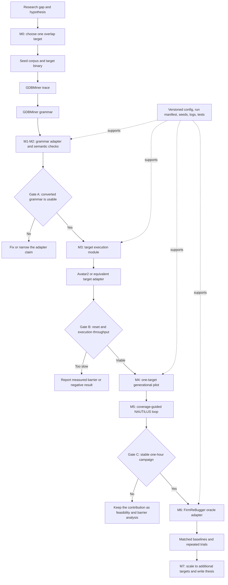

# Thesis project roadmap: GDBMiner to embedded grammar-guided fuzzing

Assessment date: 2026-08-12

This roadmap turns the proposal in [literature-review.md](literature-review.md) into a sequence of evidence gates. It is based on GDBMiner `main` at `e028fb38` and the separate `codex/nautilus-prototype` branch at `59d1550b`.

## Recommendation

**Pursue the project, but conditionally and with a narrower first claim.** The research gap is credible: the surveyed work does not close the loop from a grammar inferred from embedded firmware to grammar-guided fuzzing outcomes. The current prototype also proves that the first format seam is technically feasible.

The present proposal is too broad if GDBMiner, NAUTILUS, Avatar²/PANDA, and FirmReBugger all have to be integrated before any result exists. The defensible strategy is to prove one target end to end, measure the dominant barrier, and treat a measured throughput failure as a valid result. Do not commit to three-to-five targets or 24-hour campaigns until the single-target gates pass.

## What exists now

- GDBMiner already traces inputs, mines grammars, and contains archived STM32 grammar artifacts.
- The NAUTILUS prototype converts a real `stm32_cgidecode` grammar with 13 non-terminals into 212 NAUTILUS rules.
- Two focused adapter tests pass under Python 3.9.
- With NAUTILUS built on the guest-native filesystem and the Python/Cargo environment made explicit, the converted grammar generated ten sample inputs successfully.
- The prototype does **not** yet execute those inputs against a target, reset a re-hosted target, collect coverage, drive NAUTILUS with coverage feedback, or emit FirmReBugger reached/triggered/detected observations.

The current branch therefore demonstrates **grammar conversion and generation**, not an end-to-end fuzzing pipeline.

## Research and engineering workflow



## Milestones and exit criteria

| Milestone | Suggested timebox | Deliverable | Exit criterion and decision |
| --- | --- | --- | --- |
| **M0 — Freeze the claim and target** | Week 1 | A target matrix covering parser structure, a golden grammar, GDBMiner support, re-hosting support, and FirmReBugger oracle availability. | Select one target present at all required seams. Use `stm32_cgidecode` only as an adapter smoke target unless its benchmark/oracle overlap is confirmed. Pre-register the primary metrics and fallback negative-result claim. |
| **M1 — Reproducible toolchain** | Weeks 1-2 | One documented command that creates a guest-native work directory, pins Python 3.9, Cargo, NAUTILUS, and GDBMiner revisions, and runs a preflight. | A clean VM session can run the two adapter tests and generate ten inputs without relying on interactive shell state. Builds and experiment state do not run on the 9p/exFAT share. |
| **M2 — Prove grammar semantics** | Weeks 2-3 | Contract tests for epsilon rules, escaped braces/backslashes, non-terminal collisions, undefined symbols, and representative real grammars. A validity comparison against GDBMiner's existing generator. | Generate a pre-declared sample (for example 1,000 inputs), record acceptance/validity, and show that conversion has not silently changed the language. Stop and fix this seam before target integration if it has. |
| **M3 — Build the target execution module** | Weeks 3-5 | A small interface such as `execute(input_bytes) -> Observation`, where the observation records status, acceptance, coverage/oracle data, elapsed time, and diagnostics. Provide a deterministic local adapter for contract tests and one real re-hosted adapter. | The same contract suite passes for the local and real adapters; target reset is deterministic; timeouts and failures are classified; throughput is measured on at least 1,000 executions. This is the primary go/no-go gate. |
| **M4 — One-target generational pilot** | Weeks 5-6 | A campaign runner that feeds NAUTILUS-generated inputs through the target module and writes an immutable run manifest and observations. Include a simple random or mutation baseline. | A short campaign completes without manual intervention and reports inputs/second, validity, target outcomes, and any available coverage. If re-hosting dominates runtime, quantify it before adding coverage guidance. |
| **M5 — Coverage-guided NAUTILUS integration** | Weeks 6-8 | The smallest integration that returns target feedback to NAUTILUS and persists its corpus. Do not generalise to multiple backends yet. | One stable one-hour campaign resumes or fails cleanly, preserves seeds/config/version metadata, and produces monotonic coverage and corpus records. If this gate fails, retain the generational pilot and frame the thesis around the measured integration barrier. |
| **M6 — FirmReBugger-compatible pilot** | Weeks 8-10 | An adapter from execution observations to reached/triggered/detected states for one annotated bug, plus a matched baseline run in the same environment. | Reproduce the oracle state for a known input, then complete pre-declared repeated pilot trials. Do not compare new runs directly with published baseline numbers unless environment, target, budget, and oracle semantics are demonstrably equivalent. |
| **M7 — Scale and thesis package** | Weeks 10-14 | Add only the next one or two targets that reuse the proven seams; run the final campaign budget; generate tables/plots from immutable raw results; document threats to validity. | The repository contains the exact commands, manifests, seeds, raw observations, analysis script, and commit identifiers needed to reproduce every reported figure. |

## The software design to aim for

The useful seam is target execution, not a large class hierarchy. Keep one deep module behind a small interface:

```text
run_campaign(generator, target, budget, recorder) -> CampaignResult
                         |
                         +-- target.execute(input_bytes) -> Observation
```

Complex reset, transport, timeout, coverage, and oracle behaviour belongs inside the real target adapter. Tests should use a deterministic local adapter across the same interface. Add another production adapter only when a second backend is actually selected. Avoid a universal plugin framework, dependency-injection container, or broad rewrite of GDBMiner: none is required to answer the research questions.

## Required engineering practice

1. **Reproducible environments.** Pin the GDBMiner and NAUTILUS commits, Python and Rust versions, native packages, target firmware hash, and benchmark revision. Keep builds and mutable experiment state on the guest-native filesystem; use the shared drive for source transfer and durable artifacts.
2. **Contract, smoke, and campaign tests.** Unit-test the pure grammar conversion; contract-test every target adapter with the same behavioural cases; keep a short end-to-end smoke campaign in CI. Run long fuzzing campaigns manually or in a dedicated workflow, never in ordinary CI.
3. **Experiment manifests.** Give every run an ID and record Git commits, grammar hash, firmware hash, seeds, RNG seed, configuration, time budget, environment, start/end times, and termination reason. Raw observations are append-only; derived tables and plots are regenerated from them.
4. **Pre-registered decisions.** Choose targets, metrics, success thresholds, trial counts, exclusions, and fallback claims before seeing final results. Maintain a threats-to-validity and failed-run log so engineering failures are not silently removed from the evidence.
5. **Observable failures.** Distinguish parser rejection, target timeout, target crash, infrastructure failure, and oracle detection. Never collapse them into a single failed outcome.
6. **Narrow branch discipline.** Keep `codex/nautilus-prototype` separate until its adapter work is reviewed. Use one feature branch per milestone, small commits, an explicit review diff, and focused checks before merge.
7. **Third-party provenance.** Record exact revisions and licences for GDBMiner, NAUTILUS, Avatar²/PANDA, and FirmReBugger. Preserve the repository's AGPL notices and do not commit generated corpora, build trees, virtual environments, or local third-party checkouts.

## Immediate next work

1. Complete M0's overlap matrix before writing more integration code.
2. On the separate NAUTILUS branch, make the runner's environment preflight and native build/output location explicit, then expand the adapter contract tests.
3. Demonstrate semantic validity on one real grammar before implementing Avatar² delivery.

This ordering protects the thesis: each milestone produces publishable evidence, and the project still has a defensible result if a later integration gate fails.
